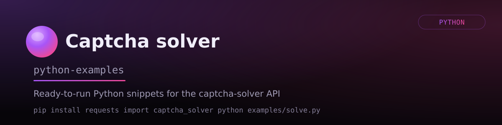

# Captcha Solver API Python Examples



A collection of examples for interacting with the [Captcha Solver](https://captcha-solver.com/) service.

This project demonstrates how to send HTTP requests to the API for solving CAPTCHA challenges. You will find examples for reCAPTCHA v2, reCAPTCHA v3, and Cloudflare Turnstile. The code helps automate task creation, status polling, and result retrieval.

---

## Installation

Clone the repository:

```bash
git clone https://github.com/captcha-solver-api/python-examples.git
cd your-repo-name

```

Install the required dependencies:

```bash
pip install -r requirements.txt

```

---

## Configuration

Use environment variables to store keys. Create a `.env` file in the root directory:

```text
CAPTCHA_API_KEY=your_api_key

```

Then load it in your code:

```python
import os
from dotenv import load_dotenv

load_dotenv()
api_key = os.getenv("CAPTCHA_API_KEY")

```

---

## Run

The repository contains ready-to-run scripts.

```text
examples/
├── recaptcha_v2.py
├── recaptcha_v2_proxy.py
├── recaptcha_v3.py
├── turnstile.py
└── get_balance.py

```

Run an example:

```bash
python examples/recaptcha_v2.py

```

---

## Quick Start

Use your API key to access service methods.

Example request structure for solving reCAPTCHA v2:

```python
import requests

response = requests.post("https://api.captcha-solver.com/createTask", json={
    "clientKey": "YOUR_API_KEY",
    "task": {
        "type": "RecaptchaV2TaskProxyless",
        "websiteURL": "https://example.com/login",
        "websiteKey": "6Le-xxxxxxxxxxxxxxxxxxxxxxxxxxxx"
    }
})

task_id = response.json().get("taskId")

```

---

## What is Inside

* Request examples using the requests library.
* Working with an API key.
* Automation of task status polling.
* Support for both proxyless and proxy tasks.
* Examples for reCAPTCHA v2, reCAPTCHA v3, and Cloudflare Turnstile.
* Python 3.8+.
* Minimal dependencies.

---

## Supported Types

| CAPTCHA Type | Proxyless | Proxy |
| --- | --- | --- |
| reCAPTCHA v2 | ✅ | ✅ |
| reCAPTCHA v3 | ✅ | ❌ |
| Cloudflare Turnstile | ✅ | ✅ |

---

## Requirements

* Python 3.8+.
* Captcha Solver account.
* Valid API key.
* Internet connection.

---

## API Documentation

See the [official service documentation](https://captcha-solver.com/en/docs/captcha-types) for full descriptions of task parameters and endpoints.

---

## Contributing

Submit a Pull Request with improvements or open an Issue if you find errors.

---

## License

This project is licensed under the MIT License.