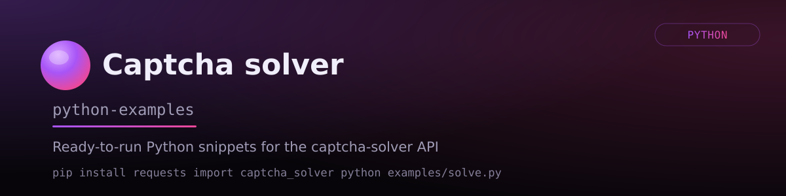

# Captcha Solver API Python Examples

A collection of examples for interacting with the [Captcha Solver](https://captcha-solver.com/) service.
This project demonstrates how to send HTTP requests to the API for solving CAPTCHA challenges. You will find examples for reCAPTCHA v2, reCAPTCHA v3, Cloudflare Turnstile, Yandex SmartCaptcha, GeeTest, Tencent, and image-based tasks. The code helps automate task creation, status polling, and result retrieval.
## Table of Contents
- [Installation](#installation)
- [Quick Start](#quick-start)
- [Supported CAPTCHA Types](#supported-types)
- [Usage Examples](#usage-examples)
  - [reCAPTCHA v2](#recaptcha-v2)
  - [reCAPTCHA v2 Enterprise](#recaptcha-v2-enterprise)
  - [reCAPTCHA v3](#recaptcha-v3)
  - [Cloudflare Turnstile](#cloudflare-turnstile)
  - [Yandex SmartCaptcha](#yandex-smartcaptcha)
  - [Image to Text](#image-to-text)
  - [Coordinates](#coordinates)
  - [GeeTest v3](#geetest-v3)
  - [GeeTest v4](#geetest-v4)
  - [Tencent](#tencent)
  - [Check Balance](#check-balance)
  - [Custom Timeout and Polling](#custom-timeout-and-polling)
  - [Error Handling](#error-handling)
- [Requirements](#requirements)
- [API Documentation](#api-documentation)
- [License](#license)
---
## Installation
Clone the repository:
```bash
git clone https://github.com/captcha-solver-api/python-examples.git
cd python-examples
```
Install dependencies:
```bash
pip install -r requirements.txt
```
Create a `.env` file in the root directory:
```text
CAPTCHA_API_KEY=your_api_key
```
Run an example:
```bash
python examples/recaptcha_v2.py
```
---
## Quick Start
This single example solves a reCAPTCHA v2. It creates a task, polls for the result, and prints the solution token.
```python
import requests
import time
API_KEY = "YOUR_API_KEY"
response = requests.post("https://api.captcha-solver.com/createTask", json={
    "clientKey": API_KEY,
    "task": {
        "type": "RecaptchaV2TaskProxyless",
        "websiteURL": "https://example.com/login",
        "websiteKey": "SITE_KEY"
    }
})
task_id = response.json().get("taskId")
while True:
    result = requests.post("https://api.captcha-solver.com/getTaskResult", json={
        "clientKey": API_KEY,
        "taskId": task_id
    }).json()
    if result.get("status") == "ready":
        print(result.get("solution", {}).get("gRecaptchaResponse"))
        break
    time.sleep(3)
```
---
## Supported Types
| Type | Proxyless | With Proxy |
|---|---|---|
| reCAPTCHA v2 | ✅ | ✅ |
| reCAPTCHA v2 Enterprise | ✅ | ✅ |
| reCAPTCHA v3 | ✅ | ❌ |
| Cloudflare Turnstile | ✅ | ✅ |
| Yandex SmartCaptcha (token) | ✅ | ✅ |
| Yandex SmartCaptcha (image) | ✅ | ❌ |
| Image to Text | ✅ | ❌ |
| Coordinates | ✅ | ❌ |
| GeeTest v3 | ✅ | ✅ |
| GeeTest v4 | ✅ | ✅ |
| Tencent | ✅ | ✅ |
---
## Usage Examples
### reCAPTCHA v2
Uses `RecaptchaV2TaskProxyless`. Add `isInvisible`, `userAgent`, or `cookies` if your target page requires them. Use `RecaptchaV2Task` for your own proxy.
```python
response = requests.post("https://api.captcha-solver.com/createTask", json={
    "clientKey": "YOUR_API_KEY",
    "task": {
        "type": "RecaptchaV2TaskProxyless",
        "websiteURL": "https://example.com",
        "websiteKey": "SITE_KEY",
        "isInvisible": False
    }
})
task_id = response.json().get("taskId")
```
### reCAPTCHA v2 Enterprise
Uses `RecaptchaV2EnterpriseTaskProxyless`. Pass `enterprisePayload` if the site uses `grecaptcha.enterprise.render` with extra parameters. Use `RecaptchaV2EnterpriseTask` for your own proxy.
```python
response = requests.post("https://api.captcha-solver.com/createTask", json={
    "clientKey": "YOUR_API_KEY",
    "task": {
        "type": "RecaptchaV2EnterpriseTaskProxyless",
        "websiteURL": "https://example.com",
        "websiteKey": "SITE_KEY",
        "enterprisePayload": {"s": "SITE_SPECIFIC_DATA"}
    }
})
task_id = response.json().get("taskId")
```
### reCAPTCHA v3
Uses `RecaptchaV3TaskProxyless`. Set `minScore` to the required threshold. Pass `pageAction` if known. Set `isEnterprise` to `true` for reCAPTCHA v3 Enterprise.
```python
response = requests.post("https://api.captcha-solver.com/createTask", json={
    "clientKey": "YOUR_API_KEY",
    "task": {
        "type": "RecaptchaV3TaskProxyless",
        "websiteURL": "https://example.com",
        "websiteKey": "SITE_KEY",
        "minScore": 0.3,
        "pageAction": "login"
    }
})
task_id = response.json().get("taskId")
```
### Cloudflare Turnstile
Uses `TurnstileTaskProxyless`. Pass `action`, `data` (cData), or `pageData` if the site uses them. Always pass `userAgent` for complex pages like Cloudflare Challenge. Use `TurnstileTask` for your own proxy.
```python
response = requests.post("https://api.captcha-solver.com/createTask", json={
    "clientKey": "YOUR_API_KEY",
    "task": {
        "type": "TurnstileTaskProxyless",
        "websiteURL": "https://example.com",
        "websiteKey": "SITE_KEY",
        "action": "login",
        "data": "CUSTOM_CDATA",
        "userAgent": "Mozilla/5.0 (Windows NT 10.0; Win64; x64) ..."
    }
})
task_id = response.json().get("taskId")
```
### Yandex SmartCaptcha
Token-based solving uses `YandexSmartCaptchaTaskProxyless` or `YandexSmartCaptchaTask`. Image-based solving uses `CoordinatesTask` with `imgType` set to `smart_captcha` or `pazl_smart_captcha`. See the Coordinates section for image examples.
```python
response = requests.post("https://api.captcha-solver.com/createTask", json={
    "clientKey": "YOUR_API_KEY",
    "task": {
        "type": "YandexSmartCaptchaTaskProxyless",
        "websiteURL": "https://example.com",
        "websiteKey": "Y5Lh0ti..."
    }
})
task_id = response.json().get("taskId")
result = requests.post("https://api.captcha-solver.com/getTaskResult", json={
    "clientKey": "YOUR_API_KEY",
    "taskId": task_id
})
print(result.json().get("solution", {}).get("token"))
```
### Image to Text
Uses `ImageToTextTask`. Set `numeric`, `minLength`, `maxLength`, or `case` to improve accuracy. Add `comment` for worker instructions.
```python
import base64
with open("captcha.png", "rb") as f:
    img_base64 = base64.b64encode(f.read()).decode("utf-8")
response = requests.post("https://api.captcha-solver.com/createTask", json={
    "clientKey": "YOUR_API_KEY",
    "task": {
        "type": "ImageToTextTask",
        "body": img_base64,
        "numeric": 1,
        "minLength": 4,
        "maxLength": 6
    }
})
task_id = response.json().get("taskId")
```
### Coordinates
Uses `CoordinatesTask`. Works for click-based captchas and Yandex SmartCaptcha image challenges. Set `imgType` to `smart_captcha` or `pazl_smart_captcha` for Yandex. Always pass `imgInstructions` for `smart_captcha`.
```python
import base64
with open("captcha.png", "rb") as f:
    img_base64 = base64.b64encode(f.read()).decode("utf-8")
response = requests.post("https://api.captcha-solver.com/createTask", json={
    "clientKey": "YOUR_API_KEY",
    "task": {
        "type": "CoordinatesTask",
        "body": img_base64,
        "comment": "click on the green apple"
    }
})
task_id = response.json().get("taskId")
```
### GeeTest v3
Uses `GeeTestTaskProxyless` or `GeeTestTask`. Requires fresh `gt` and `challenge` values from the target page on each request. Version defaults to 3.
```python
response = requests.post("https://api.captcha-solver.com/createTask", json={
    "clientKey": "YOUR_API_KEY",
    "task": {
        "type": "GeeTestTaskProxyless",
        "websiteURL": "https://example.com",
        "gt": "f2ae6cadcf7886856696c46d84d109d1",
        "challenge": "12345678abc90123d45678e90123f45g6"
    }
})
task_id = response.json().get("taskId")
```
### GeeTest v4
Uses `GeeTestTaskProxyless` or `GeeTestTask`. Set `version` to 4. Pass `initParameters` with `captcha_id` from the target page.
```python
response = requests.post("https://api.captcha-solver.com/createTask", json={
    "clientKey": "YOUR_API_KEY",
    "task": {
        "type": "GeeTestTaskProxyless",
        "websiteURL": "https://example.com",
        "version": 4,
        "initParameters": {"captcha_id": "e392e65f912c780f2c3ebac7702651de"}
    }
})
task_id = response.json().get("taskId")
```
### Tencent
Uses `TencentTaskProxyless` or `TencentTask`. Requires `appId` from the page source. Pass `captchaScript` if the site uses a non-default script URL.
```python
response = requests.post("https://api.captcha-solver.com/createTask", json={
    "clientKey": "YOUR_API_KEY",
    "task": {
        "type": "TencentTaskProxyless",
        "websiteURL": "https://example.com",
        "appId": "190014885"
    }
})
task_id = response.json().get("taskId")
```
### Check Balance
```python
response = requests.post("https://api.captcha-solver.com/getBalance", json={
    "clientKey": "YOUR_API_KEY"
})
print(response.json().get("balance"))
```
### Custom Timeout and Polling
```python
import time
task_id = "YOUR_TASK_ID"
timeout = 120
start_time = time.time()
while True:
    if time.time() - start_time > timeout:
        print("Timeout reached")
        break
    result = requests.post("https://api.captcha-solver.com/getTaskResult", json={
        "clientKey": "YOUR_API_KEY",
        "taskId": task_id
    }).json()
    if result.get("status") == "ready":
        print(result.get("solution"))
        break
    time.sleep(3)
```
### Error Handling
```python
response = requests.post("https://api.captcha-solver.com/createTask", json={
    "clientKey": "YOUR_API_KEY",
    "task": {
        "type": "RecaptchaV2TaskProxyless",
        "websiteURL": "https://example.com",
        "websiteKey": "INVALID_KEY"
    }
})
data = response.json()
if data.get("errorId") != 0:
    print(f"Error: {data.get('errorDescription')}")
```
---
## Requirements
* Python 3.8+
* [Captcha Solver](https://captcha-solver.com/) account and API key
* `requests` library (included in requirements.txt)
---
## API Documentation

See the [official service documentation](https://captcha-solver.com/en/docs/captcha-types) for full descriptions of task parameters and endpoints.
---
## License
This project is licensed under the MIT License. See [LICENSE.md](LICENSE.md) for details.